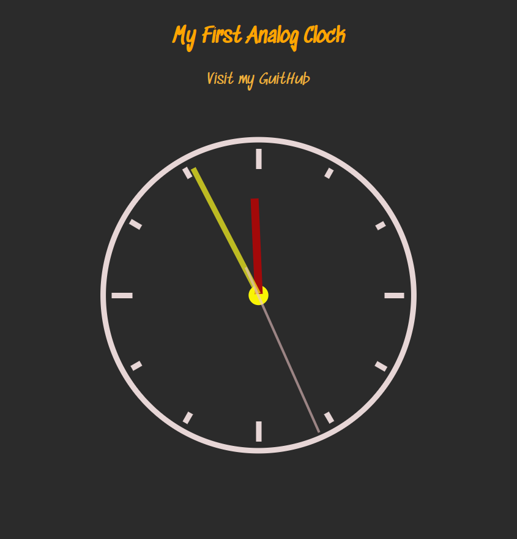

# My First analog clock

> Desenvolvimento de Relógio Analógico.

Utilizando as tecnologias, HTML, CSS, Javascript.

### 🔗 [Clique aqui para ver este projeto ao vivo](https://rogeriopedroso.github.io/analog_clock_js/)

## ⚙️ Tecnologias

- HTML
- CSS
- Git e Github

## 📨 Contato

devtoolsmod@gmail.com
